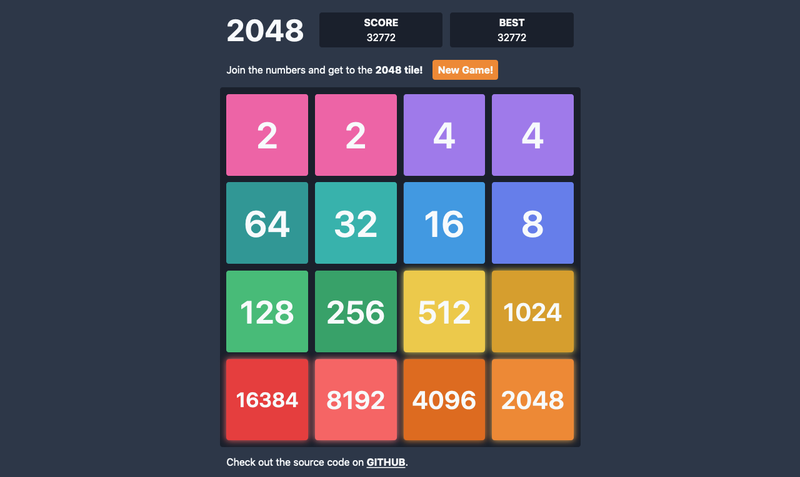

# 2048

2048 is played on a gray 4×4 grid, with numbered tiles that slide when a player moves them using the four arrow keys.

[Play it here!](https://robert-96.github.io/2048)

## Screenshot

## License

This project is licensed under the [MIT License](./LICENSE).